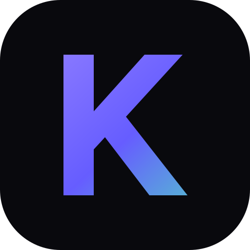

<div align="center">
  

  # KeyFlow

  **Type faster. Think clearer.**

  An adaptive typing practice platform focused on speed, accuracy, rhythm,
  coding fluency, and sustainable progress.

  [Live demo](https://keyflow-typing-practice.barkzoombie.chatgpt.site) ·
  [Report a bug](https://github.com/ZhenkeWang/keyflow-typing-practice/issues/new?template=bug-report.yml) ·
  [Request a feature](https://github.com/ZhenkeWang/keyflow-typing-practice/issues/new?template=feature-request.yml)
</div>

## Overview

KeyFlow turns a typing test into a complete training loop:

1. Practice in a focused, low-latency typing interface.
2. Review WPM, accuracy, consistency, mistakes, and rhythm.
3. Target weak keys, combinations, symbols, and coding patterns.
4. Track progress through dashboards, goals, XP, skills, and achievements.

The interface uses a restrained Apple/Linear-inspired visual system, supports
light and dark themes, and includes reduced-motion and high-contrast modes.

## Features

- Real-time WPM, CPM, accuracy, error rate, consistency, and timing
- Speed, accuracy, weak-key, rhythm, coding, number, and focused training
- Character-level feedback and responsive virtual keyboard
- Session results, error analysis, hand/finger insights, and training plans
- Local-first progress, XP, levels, streaks, missions, and achievements
- Optional Supabase authentication and cloud synchronization
- Responsive layouts, immersive mode, keyboard navigation, and PWA support
- AI Coach service layer with local performance analysis and growth prediction

## Tech stack

- React 19 and Next.js-compatible routing
- vinext and Cloudflare Workers packaging
- Zustand
- Framer Motion
- Three.js, React Three Fiber, Drei, OGL
- Node.js test runner
- Optional Supabase REST and Auth APIs

## Requirements

- Node.js 20.9 or newer
- npm 10 or newer

## Getting started

```bash
git clone https://github.com/ZhenkeWang/keyflow-typing-practice.git
cd keyflow-typing-practice
npm install
```

Copy the environment template:

```powershell
Copy-Item .env.example .env.local
```

Start the development server:

```bash
npm run dev
```

Open the local URL printed in the terminal.

## Environment variables

KeyFlow works without cloud configuration. To enable Supabase-backed accounts
and synchronization, set:

```dotenv
NEXT_PUBLIC_SUPABASE_URL=https://your-project.supabase.co
NEXT_PUBLIC_SUPABASE_ANON_KEY=your-anon-publishable-key
```

Never place a Supabase service-role key or AI provider secret in a
`NEXT_PUBLIC_*` variable. See [`.env.example`](.env.example).

The database schema is available at
[`database/supabase/001_keyflow_saas.sql`](database/supabase/001_keyflow_saas.sql).
Review its policies against your own security requirements before production
use.

## Commands

| Command | Purpose |
| --- | --- |
| `npm run dev` | Start the local development server |
| `npm test` | Run the automated test suite |
| `npm run build` | Produce and package a production build |
| `npm run start` | Start the built application |
| `npm run start:vinext` | Run the packaged Worker locally |

## Project structure

```text
app/
  animations/   Shared motion primitives
  components/   Product and training UI
  hooks/        Reusable React hooks
  models/       Application data models
  services/     Auth, cloud, AI, sharing, and sync boundaries
  stores/       Zustand state
  styles/       Design tokens and phase-specific styling
  utils/        Typing and growth engines
database/       Optional Supabase schema
public/         Icons, PWA files, and offline fallback
scripts/        Build and hosting helpers
tests/          Engine and product behavior tests
```

## Quality checks

Before opening a pull request:

```bash
npm test
npm run build
```

GitHub Actions runs the same checks for pushes and pull requests.

## Privacy

Without Supabase configuration, training progress is stored in the browser.
Cloud features are opt-in and depend on the deployer's Supabase project.
Dynamic practice material may be fetched from public news and technology
sources by a server route. See [PRIVACY.md](PRIVACY.md) for details.

## Contributing

Contributions are welcome. Read [CONTRIBUTING.md](CONTRIBUTING.md), follow the
[Code of Conduct](CODE_OF_CONDUCT.md), and use the issue templates before
submitting a pull request.

Security vulnerabilities should not be posted as public issues. Follow
[SECURITY.md](SECURITY.md).

## License

KeyFlow is licensed under the [MIT License](LICENSE), except for identified
third-party material.

`app/components/Aurora.js` is adapted from React Bits and remains subject to
the React Bits **MIT + Commons Clause** license. It is not relicensed under
KeyFlow's MIT License. See [THIRD_PARTY_NOTICES.md](THIRD_PARTY_NOTICES.md) and
[`licenses/REACT-BITS-LICENSE.md`](licenses/REACT-BITS-LICENSE.md).

Apple, Linear, Vercel, React Bits, and other referenced products are trademarks
of their respective owners. Visual references do not imply affiliation.
